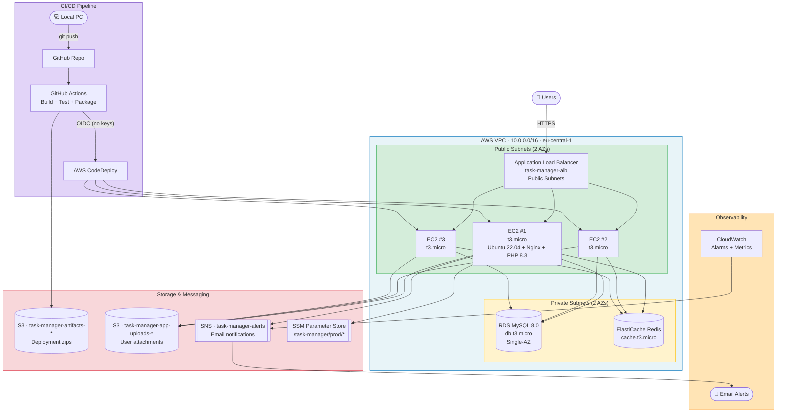
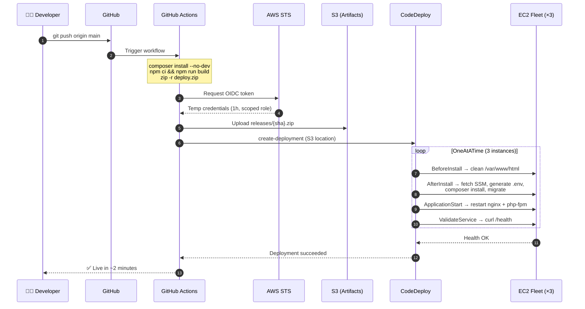

<div align="center">

# 🚀 Task Manager — AWS 3-Tier Architecture

**A production-style Laravel application deployed on AWS with a fully automated CI/CD pipeline.**

[](https://laravel.com)
[](https://php.net)
[](https://aws.amazon.com)
[](.github/workflows/deploy.yml)
[](#license)

*Deploy in ~2 minutes. Zero long-lived AWS credentials. Cost-optimized for Free Tier.*

</div>

---

## 📖 Table of Contents

- [Overview](#-overview)
- [Architecture](#-architecture)
- [AWS Services Used](#-aws-services-used)
- [CI/CD Pipeline](#-cicd-pipeline)
- [Data Tier — Redis vs RDS](#-data-tier--redis-vs-rds)
- [Cost Analysis](#-cost-analysis)
- [Repository Structure](#-repository-structure)
- [Local Development](#-local-development)
- [Deployment Guide](#-deployment-guide)
- [Lessons Learned](#-lessons-learned)
- [Future Improvements](#-future-improvements)
- [Author](#-author)

---

## 🎯 Overview

This project demonstrates a **3-tier cloud architecture** on AWS, built end-to-end from scratch:

- **Presentation Tier** — Application Load Balancer in public subnets + S3 for static/uploaded assets
- **Application Tier** — Three EC2 instances running Laravel + Nginx + PHP-FPM, managed by an Auto Scaling Group
- **Data Tier** — RDS MySQL for durable data, ElastiCache Redis for sessions/cache/queues

**The app itself is intentionally simple** (a task manager) — the focus is the AWS architecture, CI/CD pipeline, security posture, and cost optimization.

### ✨ Highlights

- ✅ **Zero-downtime deployments** via CodeDeploy in-place OneAtATime
- ✅ **OIDC-based GitHub Actions → AWS** — no `AWS_ACCESS_KEY_ID` in GitHub Secrets
- ✅ **Least-privilege IAM** across three distinct roles (EC2, CodeDeploy, GitHub Actions)
- ✅ **Secrets from SSM Parameter Store** — nothing sensitive in Git
- ✅ **Fully tagged resources** for cost attribution
- ✅ **CloudWatch alarms + SNS alerts** for proactive monitoring
- ✅ **Free Tier optimized** — no NAT Gateway, t3.micro everywhere

---

## 🏗 Architecture

### High-Level Diagram



> 📁 Extended diagrams (network topology, CI/CD sequence, data flow): [`infrastructure/diagrams/`](infrastructure/diagrams/)

### Three-Tier Breakdown

| Tier | Components | Responsibility |
|---|---|---|
| **Presentation** | ALB + S3 (static/uploaded assets) | Receive user traffic, terminate TLS, distribute across instances |
| **Application** | 3 × EC2 (Laravel + Nginx + PHP-FPM) | Business logic, auth, task CRUD, event publishing |
| **Data** | RDS MySQL + ElastiCache Redis + S3 | Durable relational data, fast cache/sessions, object storage |

### Request Lifecycle

```
1. Browser → ALB (public subnets, port 80)
2. ALB checks /health on each target, picks a healthy EC2
3. EC2 (Laravel):
     a. Session lookup → ElastiCache Redis
     b. Business data → RDS MySQL (cache miss → read-through to Redis)
     c. File access → S3 (signed URL generated on demand)
     d. Business event → SNS publish
4. Response → ALB → Browser
```

---

## ☁️ AWS Services Used

| Service | Purpose | Docs |
|---|---|---|
| **VPC** | Isolated network (10.0.0.0/16), 2 public + 2 private subnets across 2 AZs | [docs](https://docs.aws.amazon.com/vpc/) |
| **Internet Gateway** | Public internet access for public subnets | [docs](https://docs.aws.amazon.com/vpc/latest/userguide/VPC_Internet_Gateway.html) |
| **Route Tables** | Public → IGW, Private → local only (no NAT) | [docs](https://docs.aws.amazon.com/vpc/latest/userguide/VPC_Route_Tables.html) |
| **Security Groups** | Chained firewalls: ALB → EC2 → RDS/Redis (SG-to-SG references, not IPs) | [docs](https://docs.aws.amazon.com/vpc/latest/userguide/VPC_SecurityGroups.html) |
| **EC2** | 3 × `t3.micro` Ubuntu 22.04 — Laravel, Nginx, PHP 8.3 | [docs](https://docs.aws.amazon.com/ec2/) |
| **Launch Template** | Reusable blueprint for EC2 with user data + IAM role | [docs](https://docs.aws.amazon.com/AWSEC2/latest/UserGuide/ec2-launch-templates.html) |
| **Auto Scaling Group** | Maintains 3 instances, self-heals failures | [docs](https://docs.aws.amazon.com/autoscaling/) |
| **Application Load Balancer** | Distributes traffic, health checks on `/health` | [docs](https://docs.aws.amazon.com/elasticloadbalancing/latest/application/) |
| **Target Group** | Instance registry with per-target health status | [docs](https://docs.aws.amazon.com/elasticloadbalancing/latest/application/load-balancer-target-groups.html) |
| **RDS MySQL 8.0** | Durable relational storage (`db.t3.micro`, Single-AZ) | [docs](https://docs.aws.amazon.com/rds/) |
| **ElastiCache for Redis** | Sessions, cache, queues (`cache.t3.micro`) | [docs](https://docs.aws.amazon.com/elasticache/) |
| **S3** | Two buckets: deployment artifacts + user uploads | [docs](https://docs.aws.amazon.com/s3/) |
| **IAM** | 3 roles: EC2 app, CodeDeploy service, GitHub Actions (OIDC) | [docs](https://docs.aws.amazon.com/iam/) |
| **CodeDeploy** | Automated rollouts with lifecycle hooks and rollback | [docs](https://docs.aws.amazon.com/codedeploy/) |
| **SSM Parameter Store** | Runtime config (incl. SecureString for secrets) | [docs](https://docs.aws.amazon.com/systems-manager/latest/userguide/systems-manager-parameter-store.html) |
| **SNS** | Alert topic + app-level event publishing | [docs](https://docs.aws.amazon.com/sns/) |
| **CloudWatch** | Alarms for ALB health, ASG CPU, RDS connections | [docs](https://docs.aws.amazon.com/cloudwatch/) |

---

## 🔄 CI/CD Pipeline

### Flow



### Security: OIDC Instead of Long-Lived Keys

| Aspect | Access Keys (old way) | OIDC (this project) |
|---|---|---|
| Credential lifetime | Permanent until rotated | 1 hour, auto-expires |
| Storage | GitHub Secrets / .env | Nowhere — generated on demand |
| Blast radius if leaked | Full account, until noticed | Only role permissions, expires fast |
| Rotation | Manual | None needed |
| Scope | Anywhere in the world | Only `repo:USER/task-manager-aws:ref:refs/heads/main` |

**Trust policy is scoped to the exact repo and branch** (with GitHub's new immutable ID format):

```
repo:DeveloperMaher@191956391/task-manager-aws@1410820575:ref:refs/heads/main
```

### Deployment Phases (CodeDeploy Lifecycle Hooks)

| Phase | Script | Purpose |
|---|---|---|
| **BeforeInstall** | [`scripts/before_install.sh`](scripts/before_install.sh) | Wipes `/var/www/html` for clean slate |
| **AfterInstall** | [`scripts/after_install.sh`](scripts/after_install.sh) | Fetches SSM params, generates `.env`, `composer install`, `config:cache`, runs migrations |
| **ApplicationStart** | [`scripts/application_start.sh`](scripts/application_start.sh) | Restarts `php8.3-fpm` and `nginx` |
| **ValidateService** | [`scripts/validate_service.sh`](scripts/validate_service.sh) | `curl /health` — fails the deploy if not HTTP 200 |

**Automatic rollback** triggers on any phase failure.

---

## 💾 Data Tier — Redis vs RDS

### Why Two Stores?

| Concern | RDS (MySQL) | ElastiCache (Redis) |
|---|---|---|
| **Persistence** | Durable, disk-backed | Ephemeral, in-memory |
| **Latency** | 5–20 ms | < 1 ms |
| **Best for** | Users, Tasks, Projects (source of truth) | Sessions, Cache, Queues |
| **Laravel env** | `DB_CONNECTION=mysql` | `SESSION_DRIVER=redis`<br/>`CACHE_STORE=redis`<br/>`QUEUE_CONNECTION=redis` |
| **Cost** | $0 free tier (750 hrs) | $0 free tier (750 hrs) |

### Why Redis for Sessions (Critical for Multi-Instance)

With 3 EC2 instances behind an ALB, the **`file` session driver** stores sessions locally on each instance. A user routed to instance A on login, then to instance B on next request, appears logged out → CSRF 419 errors.

Redis provides a **shared session store**, so any instance can validate any user's session. This is what makes the fleet truly **stateless**.

### Read-Through Caching Pattern

```
Request → Redis lookup
         ├── hit  → return (<1ms)
         └── miss → RDS query → write result to Redis (TTL 5m) → return
```

---

## 💰 Cost Analysis

### Free Tier Limits (12 months from account creation)

| Service | Free Tier | This Project | ✓ |
|---|---|---|---|
| **EC2** | 750 hrs/mo `t3.micro` | 3 × 24/7 would exceed → **paused when idle** | ✅ |
| **RDS** | 750 hrs/mo `db.t3.micro` + 20 GB | Single-AZ, stopped between sessions | ✅ |
| **ElastiCache** | 750 hrs/mo `cache.t3.micro` | 1 node, no replicas | ✅ |
| **ALB** | 750 hrs/mo + 15 GB | Under 1 ALB | ✅ |
| **S3** | 5 GB + 20K GET + 2K PUT | Artifacts auto-expire 30 days | ✅ |
| **SNS** | 1M publishes + 1K emails | ~10 emails/mo | ✅ |
| **CodeDeploy** | Free for EC2 | Always free | ✅ |
| **CloudWatch** | 10 alarms + 5 GB logs | 4 alarms | ✅ |
| **SSM Parameter Store** | Standard params free | 10 params | ✅ |
| **IAM / STS** | Always free | — | ✅ |

### Cost-Avoiding Decisions

| Decision | Savings | Trade-off |
|---|---|---|
| **No NAT Gateway** | ~$32/mo | EC2 in public subnets — mitigated by Security Groups |
| **Single-AZ RDS** | 50% vs Multi-AZ | No standby failover |
| **`t3.micro` everywhere** | Free tier eligible | Limited CPU burst |
| **Pause ASG when idle** | `desired=0` → $0 EC2 | Manual resume |
| **S3 lifecycle 30 days** | Prevents artifact bloat | Old deploys deleted |
| **No ElastiCache replicas** | 50% vs 1 replica | No failover |

### Pause / Resume

```bash
# Pause (EC2 cost → $0)
aws autoscaling update-auto-scaling-group \
  --auto-scaling-group-name task-manager-asg \
  --min-size 0 --desired-capacity 0

# Resume
aws autoscaling update-auto-scaling-group \
  --auto-scaling-group-name task-manager-asg \
  --min-size 1 --desired-capacity 3
```

> 💡 **Production note:** this project intentionally prioritizes Free Tier learning. Production would use private subnets + NAT, Multi-AZ RDS, and HA cache clusters.

---

## 📁 Repository Structure

```
task-manager-aws/
├── .github/
│   └── workflows/
│       └── deploy.yml              # GitHub Actions pipeline
├── app/                            # Laravel application code
│   ├── Http/Controllers/
│   │   └── TaskController.php
│   ├── Models/
│   ├── Policies/
│   └── Services/
│       └── SnsService.php          # SNS publisher
├── bootstrap/cache/                # Laravel framework cache (gitignored)
├── config/
│   ├── filesystems.php             # S3 disk config
│   └── services.php                # SNS config
├── database/migrations/
├── infrastructure/                 # Documentation & IaC
│   └── diagrams/                   # Mermaid source files
│       ├── architecture.md
│       ├── network.md
│       ├── cicd-flow.md
│       └── data-tier.md
├── public/                         # Web root (Nginx document root)
├── resources/views/                # Blade templates
├── routes/
│   └── web.php
├── scripts/                        # CodeDeploy hook scripts
│   ├── before_install.sh
│   ├── after_install.sh
│   ├── application_start.sh
│   └── validate_service.sh
├── storage/                        # Laravel runtime (gitignored)
├── tests/
├── appspec.yml                     # CodeDeploy manifest
├── composer.json
├── package.json
├── README.md                       # This file
└── .env.example                    # Environment template
```

---

## 🖥 Local Development

### Requirements

- PHP 8.3+ · Composer · Node.js 20+ · MySQL (XAMPP/Laravel Herd) or SQLite

### Setup

```bash
# 1. Clone
git clone https://github.com/DeveloperMaher/task-manager-aws.git
cd task-manager-aws

# 2. Install
composer install
npm install

# 3. Configure
cp .env.example .env
php artisan key:generate

# 4. Configure local DB in .env (MySQL or SQLite)

# 5. Migrate & run
php artisan migrate
npm run dev
php artisan serve
```

Visit [http://127.0.0.1:8000](http://127.0.0.1:8000)

**Local defaults:** `SESSION_DRIVER=file`, `CACHE_STORE=file`, `QUEUE_CONNECTION=sync`, `FILESYSTEM_DISK=local` — no Redis or S3 required locally.

---

## 🚢 Deployment Guide

### Automated (every push)

```bash
git push origin main
```

GitHub Actions builds, uploads to S3, triggers CodeDeploy. Rollout completes in ~2–7 minutes with automatic rollback on failure.

### One-Time AWS Setup

<details>
<summary>Click to expand the full setup steps</summary>

1. **VPC & Networking** — VPC (10.0.0.0/16), 4 subnets, IGW, 2 route tables, 4 security groups
2. **IAM Roles** — `EC2-Laravel-App-Role`, `CodeDeploy-Service-Role`, `GitHubActions-Deploy-Role` (OIDC)
3. **Launch Template** — Ubuntu 22.04, t3.micro, user data installs Nginx + PHP 8.3 + Composer + AWS CLI + CodeDeploy Agent
4. **Auto Scaling Group** — desired 3, min 1, max 3, across 2 public subnets
5. **ALB + Target Group** — HTTP:80, health check `/health`, target type Instances
6. **RDS MySQL** — `db.t3.micro`, single-AZ, private subnet, `task_manager` database
7. **ElastiCache Redis** — `cache.t3.micro`, single node, private subnet
8. **S3 Buckets** — `task-manager-artifacts-*` (deploys) + `task-manager-app-uploads-*` (user files)
9. **SSM Parameters** — `/task-manager/prod/*` (DB, Redis, S3, SNS, APP_KEY)
10. **CodeDeploy** — Application + Deployment Group (In-Place, OneAtATime, target group bound)
11. **GitHub OIDC Role** — trust policy scoped to `repo:USER/REPO:ref:refs/heads/main`
12. **GitHub Actions Workflow** — `.github/workflows/deploy.yml`

</details>

### Deployment Verification

```bash
# Check target health
curl http://<alb-dns-name>/health
# → OK

# Watch a deployment
aws deploy list-deployments --application-name task-manager-app --query "deployments[0]"

# Tail the app log on any instance
ssh ubuntu@<instance-ip> 'sudo tail -f /var/www/html/storage/logs/laravel.log'
```

---

## 🧠 Lessons Learned

Building this end-to-end surfaced 12 real production-grade issues. Each taught a specific lesson.

### 1. `set -e` is a double-edged sword

**Symptom:** `after_install.sh` failed at `view:cache` and never reached migrations.

**Lesson:** In deployment scripts, use `set -e` for critical steps, but guard non-critical ones: `php artisan view:cache || echo "skipped"`. A single non-essential failure should never roll back an entire deploy.

### 2. Empty directories don't travel in Git

**Symptom:** `Please provide a valid cache path` after `before_install.sh` wiped `/var/www/html`.

**Lesson:** Git doesn't track empty folders. Deployment scripts must `mkdir -p` runtime directories (`storage/framework/*`, `bootstrap/cache`) on every deploy.

### 3. Multi-instance Laravel needs a shared `APP_KEY`

**Symptom:** `419 Page Expired` on register despite valid CSRF.

**Lesson:** Each EC2 generated its own `APP_KEY`, so encrypted session cookies from instance A couldn't be decrypted on instance B. Fix: store `APP_KEY` once in **SSM Parameter Store (SecureString)** and inject at deploy time.

### 4. Sessions must live outside the fleet

**Symptom:** User randomly logged out between requests.

**Lesson:** `SESSION_DRIVER=file` isolates sessions per instance. A shared store (Redis) makes the fleet truly **stateless** and horizontally scalable.

### 5. Cloud-init has no `HOME`

**Symptom:** Composer silently failed during user data.

**Lesson:** The `HOME` env var is unset during cloud-init. Always `export HOME=/root` before tools that rely on it. Silent failures in bootstrap scripts are the hardest to debug — always log to a file.

### 6. AWS CLI isn't installed by default

**Symptom:** `after_install.sh` exited 127 (command not found).

**Lesson:** Ubuntu 22.04 no longer ships `awscli` in default repos. Install AWS CLI v2 via the official installer in user data.

### 7. GitHub OIDC now uses immutable subject claims

**Symptom:** `Not authorized to perform sts:AssumeRoleWithWebIdentity` with a policy that "looked correct".

**Lesson:** GitHub's new immutable `sub` format includes numeric IDs: `repo:USER@ID/REPO@ID:ref:refs/heads/main`. Fetch IDs from the GitHub API and update the trust policy accordingly.

### 8. IAM propagation delays are real

**Symptom:** Trust policy changes didn't take effect for 30–60 seconds.

**Lesson:** After updating IAM, wait before re-running. Don't debug the same thing twice.

### 9. Config caches can reference stale paths

**Symptom:** `View path not found` even after the files existed.

**Lesson:** Laravel's `bootstrap/cache/config.php` from a previous deploy can reference paths that no longer exist. Always clear cache **before** generating new ones.

### 10. Security Groups should reference each other, not IPs

**Lesson:** Chaining SG-to-SG (ALB → EC2 → RDS) means new instances inherit correct permissions automatically. Never hardcode IPs where SG references work.

### 11. Cost-optimize from day one

**Lesson:** No NAT Gateway ($32/mo saved). Set `desired=0` on the ASG when idle. Auto-expire S3 artifacts. Use Free Tier eligible instance types exclusively.

### 12. Observability closes the loop

**Lesson:** "Deployment succeeded" ≠ "app is healthy." Adding `/health` + CloudWatch alarms + SNS email turns reactive ops into proactive ops.

---

## 🔮 Future Improvements

Documented here for transparency — these are the "if this were production" upgrades.

### Infrastructure

- [ ] **Terraform / CDK** — codify everything in `infrastructure/` (currently manual + documented)
- [ ] **Private subnets + NAT Gateway** — move EC2 out of public subnets (currently a cost trade-off)
- [ ] **Multi-AZ RDS** — enable standby for automatic failover
- [ ] **ElastiCache with replicas + Multi-AZ** — HA cache layer
- [ ] **ACM certificate + HTTPS** — terminate TLS at ALB
- [ ] **Route 53 custom domain** — replace the ALB DNS name
- [ ] **WAF** — protect the ALB from common attacks
- [ ] **Blue/Green deployments** — zero-risk rollouts via CodeDeploy

### Security

- [ ] **Custom least-privilege S3 policies** — replace `AmazonS3FullAccess` with bucket-scoped access
- [ ] **Custom SNS publish policy** — scope to the specific topic ARN
- [ ] **Secrets Manager** with rotation — upgrade from SSM SecureString
- [ ] **VPC Flow Logs + CloudTrail** — audit trail
- [ ] **GuardDuty** — threat detection
- [ ] **EC2 Instance Connect / SSM Session Manager** — eliminate SSH entirely

### Observability

- [ ] **CloudWatch Agent** — ship Laravel + Nginx logs to CloudWatch Logs
- [ ] **X-Ray** — distributed tracing
- [ ] **Custom CloudWatch metrics** — business KPIs (tasks created/min)
- [ ] **Grafana / Datadog dashboards**

### Application

- [ ] **Queue workers on a dedicated instance** — move `QUEUE_CONNECTION=redis` jobs off web nodes
- [ ] **Horizon** — Redis queue dashboard
- [ ] **Feature tests + CI coverage gate**
- [ ] **API resources for a mobile client**
- [ ] **Real-time events via WebSockets**

---

## 👤 Author

**Maher** — Full-Stack Developer (Laravel · Angular · Node.js)

- 🐙 GitHub: [@DeveloperMaher](https://github.com/DeveloperMaher)
- 💼 LinkedIn: [Maher Shalash](https://www.linkedin.com/in/maher-shalash/)
- 📧 Email: [m.shalash@outlook.de](mailto:m.shalash@outlook.de)

---

## 📜 License

This project is licensed under the **MIT License** — see the [LICENSE](LICENSE) file for details.

---

<div align="center">

**⭐ If this project helped you learn AWS, consider giving it a star.**

*Built with ☕ and a lot of `git push`*

</div>