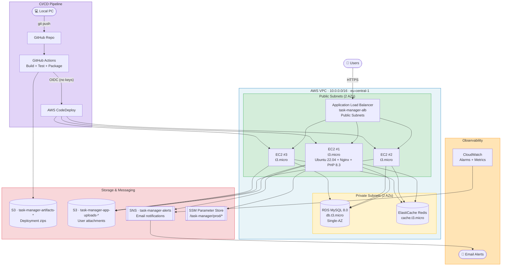

# High-Level Architecture



## Tier Responsibilities

| Tier | Components | Responsibility |
|---|---|---|
| **Presentation** | ALB + S3 (static/uploaded assets) | Receive user traffic, terminate TLS, distribute across instances |
| **Application** | 3 × EC2 (Laravel + Nginx + PHP-FPM) | Business logic, authentication, task CRUD, event publishing |
| **Data** | RDS MySQL + ElastiCache Redis + S3 | Durable relational data, fast cache/sessions, object storage |

## Request Lifecycle

```
1. Browser → ALB (public subnets, port 80)
2. ALB checks /health on each target, picks a healthy EC2
3. EC2 (Laravel):
     a. Session lookup → ElastiCache Redis
     b. Business data → RDS MySQL (cache miss → read-through to Redis)
     c. File access → S3 (signed URL generated on demand)
     d. Business event → SNS publish
4. Response → ALB → Browser
```