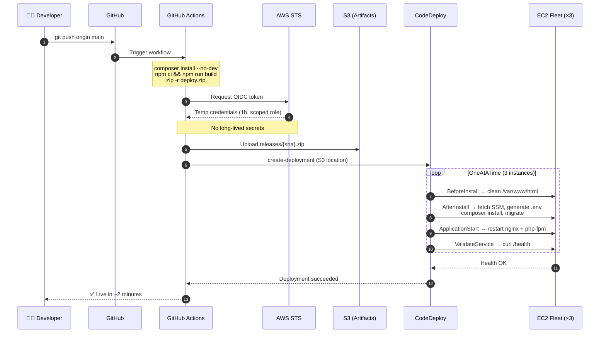
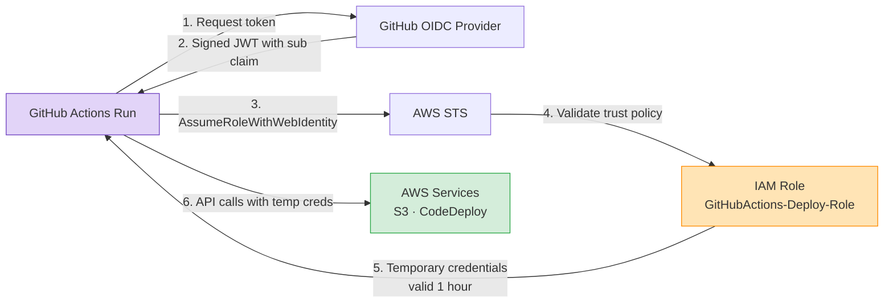
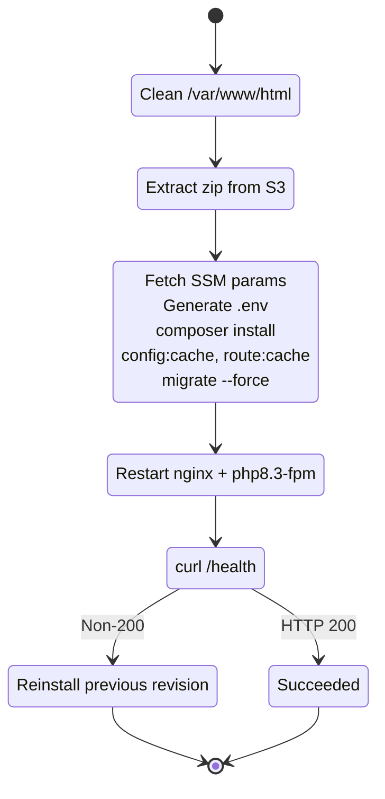
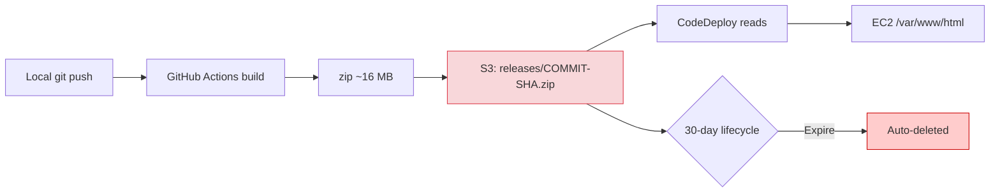

# CI/CD Pipeline

## End-to-End Flow



## Authentication: OIDC Instead of Access Keys



### Trust Policy Scoping

The IAM role's trust policy uses GitHub's **immutable subject format** (new since July 2026 for all repos), scoped to the exact repository and branch:

```
repo:DeveloperMaher@191956391/task-manager-aws@1410820575:ref:refs/heads/main
```

| Component | Value | Purpose |
|---|---|---|
| `repo:` | Prefix | OIDC claim type |
| `DeveloperMaher@191956391` | Owner + numeric ID | Immutable user identity |
| `task-manager-aws@1410820575` | Repo + numeric ID | Immutable repo identity |
| `ref:refs/heads/main` | Branch ref | Only `main` pushes can assume the role |

**Why immutable IDs?** If the repo is renamed or transferred, the old name could be re-registered by an attacker. The numeric ID is permanent — it can never be reused.

## Deployment Lifecycle (CodeDeploy Hooks)



| Phase | Script | Failure action |
|---|---|---|
| **BeforeInstall** | `scripts/before_install.sh` | Deploy fails |
| **AfterInstall** | `scripts/after_install.sh` | Deploy fails (rollback if enabled) |
| **ApplicationStart** | `scripts/application_start.sh` | Deploy fails (rollback if enabled) |
| **ValidateService** | `scripts/validate_service.sh` | Deploy fails + **automatic rollback** |

## Rollout Strategy: OneAtATime

```
Instance 1: [BlockTraffic] → [Deploy] → [AllowTraffic] ✅
                                                          ↓
Instance 2:                                  [BlockTraffic] → [Deploy] → [AllowTraffic] ✅
                                                                                 ↓
Instance 3:                                                          [BlockTraffic] → [Deploy] → [AllowTraffic] ✅
```

**At any moment, at least 2 of 3 instances serve healthy traffic.** The ALB automatically stops routing to the instance being updated (via target group deregistration).

| Strategy | Time (3 instances) | Risk |
|---|---|---|
| **OneAtATime** (used) | ~5–7 min | Lowest — 2 healthy instances always |
| HalfAtATime | ~3–4 min | Medium — 1 healthy instance during deploy |
| AllAtOnce | ~2 min | Highest — brief downtime |

## Artifact Lifecycle



Each commit produces a uniquely-named zip (`{sha}.zip`), so you can always redeploy a specific revision via CodeDeploy console by pasting the SHA.