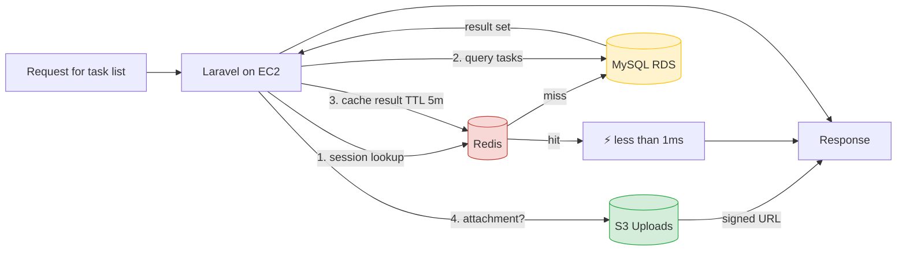
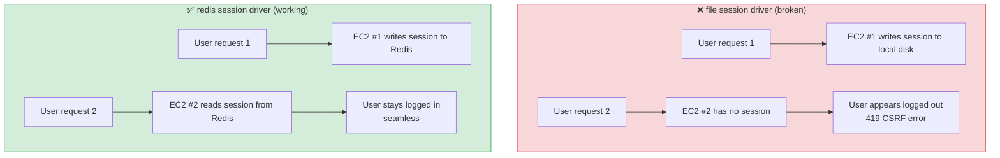
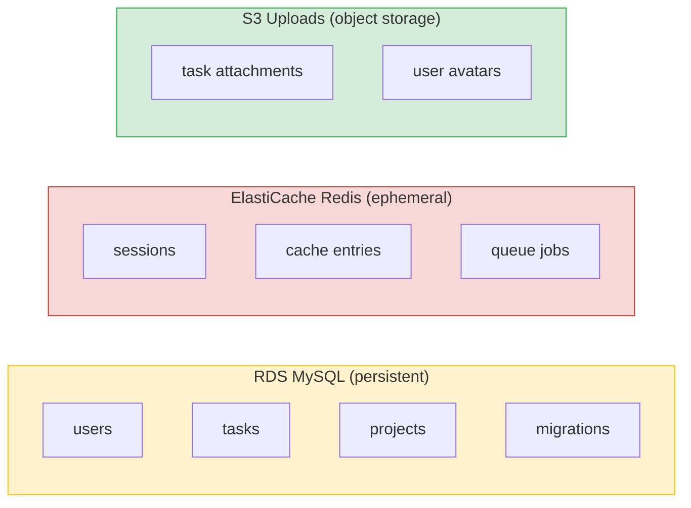

# Data Tier — Request Flow

## Read-Through Cache Pattern



## Why Two Data Stores?

| Concern | RDS (MySQL) | ElastiCache (Redis) |
|---|---|---|
| **Persistence** | Durable, disk-backed | Ephemeral, in-memory |
| **Latency** | 5–20 ms | less than 1 ms |
| **Best for** | Users, Tasks, Projects (source of truth) | Sessions, Cache, Queues |
| **Laravel env** | `DB_CONNECTION=mysql` | `SESSION_DRIVER=redis`<br/>`CACHE_STORE=redis`<br/>`QUEUE_CONNECTION=redis` |
| **Cost (free tier)** | 750 hrs/mo `db.t3.micro` | 750 hrs/mo `cache.t3.micro` |
| **Backup** | Automated daily (if enabled) | None by default (ephemeral) |

## Why Redis for Sessions (Critical for Multi-Instance)



**The core problem:** with 3 EC2 instances behind an ALB, a user's requests land on different instances. If sessions live on each instance's local disk, they vanish on each hop.

**The fix:** Redis acts as a **shared session store** — any instance can read any user's session. This is what makes the EC2 fleet truly **stateless** and horizontally scalable.

## Session & Cache Configuration

```env
# .env on each EC2 (generated by after_install.sh from SSM)
SESSION_DRIVER=redis
SESSION_LIFETIME=120
SESSION_ENCRYPT=false

CACHE_STORE=redis
QUEUE_CONNECTION=redis

REDIS_CLIENT=predis
REDIS_HOST=task-manager-redis.xxxxx.0001.euc1.cache.amazonaws.com
REDIS_PORT=6379
REDIS_PASSWORD=null
```

## What Lives Where



| Data | Store | Why |
|---|---|---|
| Users, Tasks, Projects | **RDS** | Durable, relational, transactions |
| Sessions | **Redis** | Fast, shared across instances, TTL |
| Cache entries | **Redis** | Sub-millisecond reads, auto-expiry |
| Queue jobs | **Redis** | Fast producer/consumer, transient |
| File attachments | **S3** | Object storage, unlimited size, cheap |
| Runtime config | **SSM Parameter Store** | Centralized, encrypted, versioned |

## Cache Invalidation Strategy

- **Sessions**: TTL 120 minutes, refreshed on each request
- **Cache**: TTL 5 minutes for read-heavy queries (task lists)
- **Deploys**: `after_install.sh` clears Redis cache keys on each deploy (via `php artisan cache:clear` or config cache flush)

## Failure Modes

| If this dies... | Impact | Recovery |
|---|---|---|
| **RDS** | Full app failure (no persistent data) | Restart RDS; app resumes (Single-AZ = no auto-failover) |
| **Redis** | Sessions lost → all users logged out | Restart ElastiCache; sessions regenerate |
| **S3** | Attachments unavailable; deploys blocked | S3 is highly durable (11 9's) — very rare |
| **One EC2** | 1/3 capacity lost | ALB removes it; ASG replaces it in ~3 min |

**For your README:** Redis is not just a performance optimization in a multi-instance Laravel setup — it's a **correctness requirement**. Without it, sessions break unpredictably as users hop between instances.