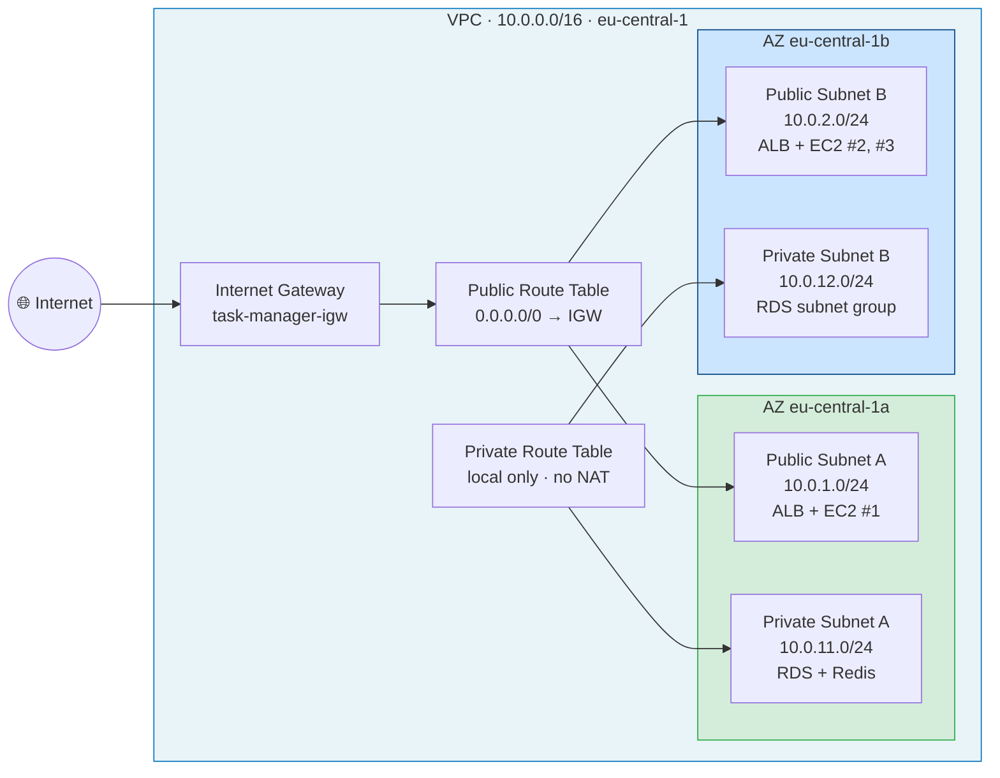
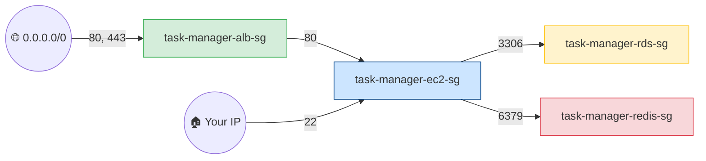

# Network Topology

## CIDR Allocation

| Component | CIDR | AZ | Purpose |
|---|---|---|---|
| VPC | `10.0.0.0/16` | — | Isolated network (65K IPs) |
| Public Subnet A | `10.0.1.0/24` | eu-central-1a | ALB + EC2 #1 |
| Public Subnet B | `10.0.2.0/24` | eu-central-1b | ALB + EC2 #2, #3 |
| Private Subnet A | `10.0.11.0/24` | eu-central-1a | RDS primary + Redis |
| Private Subnet B | `10.0.12.0/24` | eu-central-1b | RDS subnet group member |

**Why 2 AZs?** ALB requires ≥2 AZs for high availability. RDS subnet groups require ≥2 AZs even for Single-AZ deployments.

**Why /24?** 251 usable IPs per subnet is plenty for a small fleet and leaves room for growth.

## Route Tables

### Public Route Table (`public-rt`)

| Destination | Target | Purpose |
|---|---|---|
| `10.0.0.0/16` | local | Intra-VPC traffic |
| `0.0.0.0/0` | Internet Gateway | Outbound internet access |

**Associated with:** `public-subnet-a`, `public-subnet-b`

### Private Route Table (`private-rt`)

| Destination | Target | Purpose |
|---|---|---|
| `10.0.0.0/16` | local | Intra-VPC traffic only |

**Associated with:** `private-subnet-a`, `private-subnet-b`

**No NAT Gateway** — saves ~$32/month. Private subnets have no outbound internet.

## Security Group Chain

Every layer only accepts traffic from the layer in front of it — never from IPs.

| Source | Destination | Port | Purpose |
|---|---|---|---|
| `0.0.0.0/0` | `task-manager-alb-sg` | 80, 443 | Public HTTP/HTTPS |
| `task-manager-alb-sg` | `task-manager-ec2-sg` | 80 | ALB → EC2 only |
| Your IP | `task-manager-ec2-sg` | 22 | SSH for debugging |
| `task-manager-ec2-sg` | `task-manager-rds-sg` | 3306 | EC2 → MySQL |
| `task-manager-ec2-sg` | `task-manager-redis-sg` | 6379 | EC2 → Redis |

**Why SG-to-SG references (not IPs)?** When the ASG replaces an instance, the new one automatically inherits the correct access via its security group — no IP juggling required.

## Cost Decision: No NAT Gateway

| Approach | Monthly Cost | Security |
|---|---|---|
| Private EC2 + NAT Gateway | ~$32 NAT + instance | Higher (no public IP) |
| **Public EC2, no NAT** (this project) | **$0** | Medium — Security Groups still block direct access |

This project intentionally chooses cost optimization for a learning environment. Instances sit in public subnets but are protected by the SG chain (only the ALB can reach port 80, only your IP can reach port 22).

**Production upgrade:** move EC2 to private subnets + NAT Gateway — noted in README's Future Improvements.